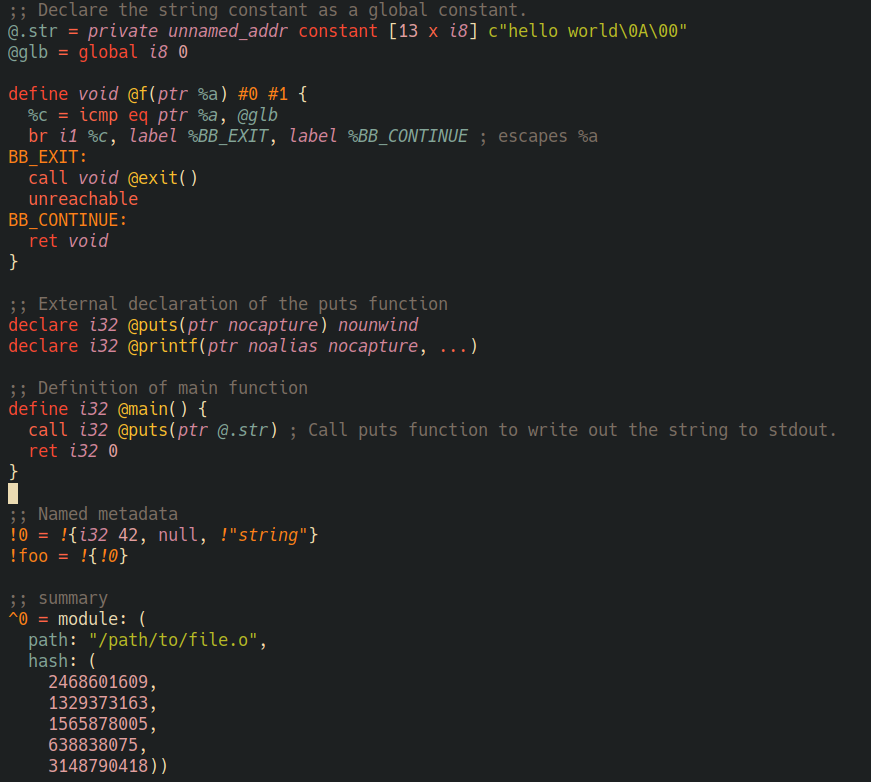

# LLVM major mode using tree-sitter

[](https://www.gnu.org/licenses/gpl-3.0)

This package is compatible with and was tested against the tree-sitter grammar
for LLVM found at [tree-sitter-llvm](https://github.com/benwilliamgraham/tree-sitter-llvm).

This mode provides the following features for LLVM source buffers:

  - font-locking
  - indentation
  - structural navigation with tree-sitter objects
  - imenu
  


## Installing

Emacs 29.1 or above with tree-sitter support is required. 

Tree-sitter starter guide: https://git.savannah.gnu.org/cgit/emacs.git/tree/admin/notes/tree-sitter/starter-guide?h=emacs-29

### Install tree-sitter parser for LLVM

```elisp
(add-to-list
 'treesit-language-source-alist
 '(llvm "https://github.com/benwilliamgraham/tree-sitter-llvm"))
(treesit-install-language-grammar 'llvm)
```

### Install llvm-ts-mode.el from source

- Clone this repository
- Add the following to your emacs config

```elisp
(require "[cloned nverno/llvm-ts-mode]/llvm-ts-mode.el")
```
